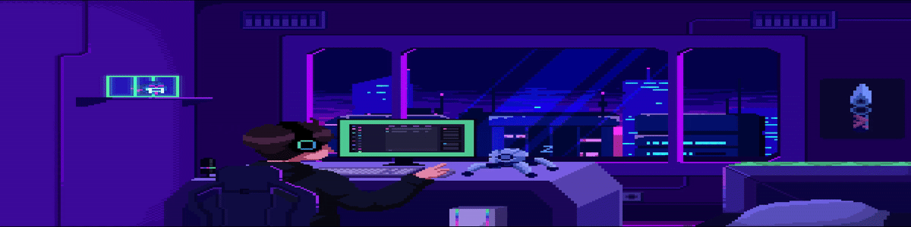

 
   ## Mechanics Enthusiast | Blogger | Penetration Tester 

Welcome to my GitHub! I'm passionate about cybersecurity, ethical hacking, and continuous learning in the ever-evolving world of technology.

- 🔭 **Currently Working On:** A new hacking course with a certificate for completion.
- 🌱 **Learning:** Python, Bash, C & Web Pentesting + AD
- 👯 **Collaborating:** New Projects.
- 📫 **Reach Me At:** [Discord - SecOps Rex]([https://discordapp.com/users/925155525899989063])
- ⚡ **Fun Fact:** I approach everything with a sense of fun and curiosity. Life's too short to be too serious!

### Languages and Tools:

[![Python][python-shield]][python-url]
[![Bash][bash-shield]][bash-url]
[![Kali Linux][kali-linux-shield]][kali-linux-url]
[![Metasploit][metasploit-shield]][metasploit-url]
[![C][c-shield]][c-url]
[![HTML5][html5-shield]][html5-url]
[![JavaScript][javascript-shield]][javascript-url]
[![CSS3][css3-shield]][css3-url]
[![Wireshark][wireshark-shield]][wireshark-url]
[![Nmap][nmap-shield]][nmap-url]
[![PowerShell][powershell-shield]][powershell-url]
[![Batch][batch-shield]][batch-url]

<!-- Shields Links -->
[python-shield]: https://img.shields.io/badge/Python-3776AB?style=for-the-badge&logo=python&logoColor=white
[python-url]: https://python.org
[bash-shield]: https://img.shields.io/badge/Bash-4EAA25?style=for-the-badge&logo=gnu-bash&logoColor=white
[bash-url]: https://www.gnu.org/software/bash/
[kali-linux-shield]: https://img.shields.io/badge/Kali_Linux-557C94?style=for-the-badge&logo=kali-linux&logoColor=white
[kali-linux-url]: https://www.kali.org/
[metasploit-shield]: https://img.shields.io/badge/Metasploit-FF1111?style=for-the-badge&logo=metasploit&logoColor=white
[metasploit-url]: https://www.metasploit.com/
[c-shield]: https://img.shields.io/badge/C-A8B9CC?style=for-the-badge&logo=c&logoColor=white
[c-url]: https://en.wikipedia.org/wiki/C_(programming_language)
[html5-shield]: https://img.shields.io/badge/HTML5-E34F26?style=for-the-badge&logo=html5&logoColor=white
[html5-url]: https://html.spec.whatwg.org/
[javascript-shield]: https://img.shields.io/badge/JavaScript-F7DF1E?style=for-the-badge&logo=javascript&logoColor=black
[javascript-url]: https://developer.mozilla.org/en-US/docs/Web/JavaScript
[css3-shield]: https://img.shields.io/badge/CSS3-1572B6?style=for-the-badge&logo=css3&logoColor=white
[css3-url]: https://www.w3.org/Style/CSS/Overview.en.html
[wireshark-shield]: https://img.shields.io/badge/Wireshark-1679A7?style=for-the-badge&logo=wireshark&logoColor=white
[wireshark-url]: https://www.wireshark.org/
[nmap-shield]: https://img.shields.io/badge/Nmap-0E83CD?style=for-the-badge&logo=nmap&logoColor=white
[nmap-url]: https://nmap.org/
[powershell-shield]: https://img.shields.io/badge/PowerShell-5391FE?style=for-the-badge&logo=powershell&logoColor=white
[powershell-url]: https://docs.microsoft.com/en-us/powershell/
[batch-shield]: https://img.shields.io/badge/Batch-4D4D4D?style=for-the-badge&logo=windows&logoColor=white
[batch-url]: https://en.wikipedia.org/wiki/Batch_file

# 💻 Tech Stack:

                                             

### ⚙️Projects

- **Blue Ducky:** [0-click-BT-Vuln](https://github.com/pentestfunctions/BlueDucky)
- **WSL Seamless mode:** [WSL-Seamless](https://github.com/pentestfunctions/WSL-Seamless)
- **Blue Ducky:** [Just a Python script lol](https://github.com/pentestfunctions/BlueDucky)

## 🏆 GitHub Trophies

